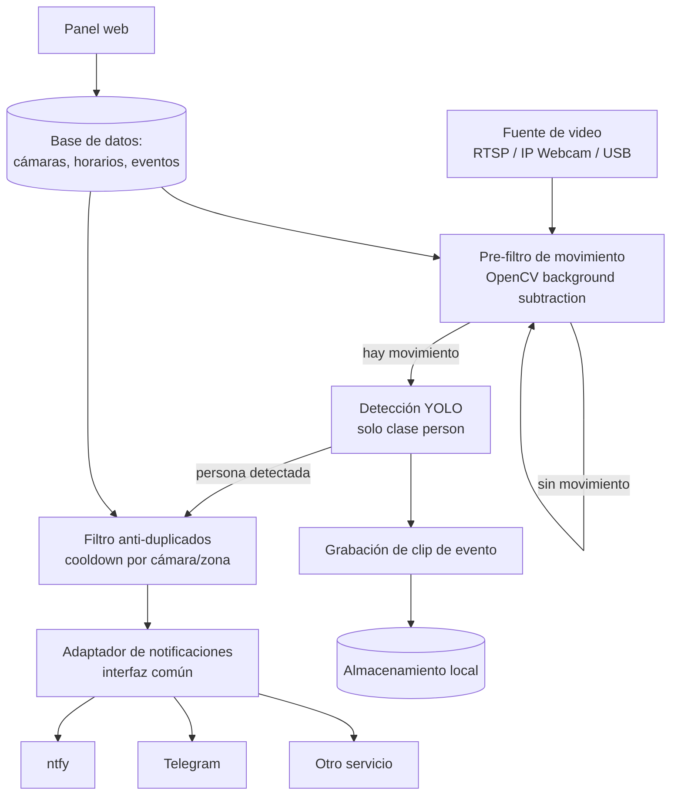

# Sistema de detección de personas para videovigilancia
### Documento técnico de proyecto

---

## 1. Resumen

Sistema de videovigilancia inteligente que procesa video en tiempo real (cámaras IP, RTSP, o teléfono vía IP Webcam), detecta específicamente **personas** (no animales ni mascotas), y envía notificaciones inmediatas a través de un adaptador de notificaciones desacoplado (ntfy, Telegram, u otro servicio intercambiable sin tocar la lógica central).

**Problema que resuelve:** las cámaras de seguridad tradicionales graban evidencia *después* de un robo, cuando ya es tarde. Este sistema avisa *mientras* está ocurriendo, para que el dueño pueda reaccionar a tiempo.

---

## 2. Propuesta de valor y diferenciación

Existen soluciones open source maduras para esto (ej. [Frigate NVR](https://frigate.video)), por lo que el valor de este proyecto no está en reinventar el detector, sino en el enfoque:

| Eje | Enfoque de este proyecto |
|---|---|
| Público objetivo | Negocios tradicionales y familiares (no usuarios técnicos que configuran YAML) |
| Hardware de entrada | Aprovechar un celular viejo como cámara (IP Webcam), sin comprar equipo dedicado |
| Modelo de entrega | Producto + servicio: instalación, configuración de zonas/horarios y soporte, no solo software autoinstalable |
| Alcance funcional | Enfoque estrecho y profundo en "avisar si hay una persona sospechosa", no un NVR completo con 50 integraciones |
| Canal de notificación | Pensado para el flujo de comunicación local (ntfy / WhatsApp / Telegram), no solo un dashboard que hay que revisar |

---

## 3. Arquitectura general



**Principio de diseño clave:** el pre-filtro de movimiento existe porque correr YOLO en cada frame es costoso. Solo se invoca el modelo de detección cuando el frame ya mostró cambio significativo respecto al fondo — esto reduce el uso de CPU/GPU entre 80-95% en escenas típicas.

---

## 4. Componentes técnicos

### 4.1 Captura de video
- OpenCV (`cv2.VideoCapture`) sobre RTSP/HTTP para cámaras IP, o la URL de stream MJPEG que expone la app IP Webcam en Android.
- Un proceso/hilo independiente por cámara, para que una cámara lenta o desconectada no bloquee a las demás.

### 4.2 Pre-filtro de movimiento (barato)
```python
import cv2

class MotionDetector:
    def __init__(self, history=500, var_threshold=16, min_area_ratio=0.01):
        self.bg_subtractor = cv2.createBackgroundSubtractorMOG2(
            history=history, varThreshold=var_threshold, detectShadows=False
        )
        self.min_area_ratio = min_area_ratio

    def has_motion(self, frame) -> bool:
        mask = self.bg_subtractor.apply(frame)
        mask = cv2.medianBlur(mask, 5)
        motion_pixels = cv2.countNonZero(mask)
        total_pixels = frame.shape[0] * frame.shape[1]
        return (motion_pixels / total_pixels) > self.min_area_ratio
```

### 4.3 Detección con YOLO
- Modelo recomendado: **YOLOv8n / YOLOv11n** (Ultralytics) para CPU; variante `s` si hay GPU disponible.
- Filtrar resultados a la clase `person` (índice 0 en COCO) y descartar el resto.
- Procesar a resolución reducida (ej. 640x384) y a una tasa de N fps (5 fps suele ser suficiente), no a la tasa nativa de la cámara.

### 4.4 Filtro anti-duplicados (cooldown)
- Tras notificar un evento en una cámara/zona, silenciar nuevas notificaciones de esa misma zona durante un periodo configurable (ej. 60s), aunque la persona siga en cuadro.
- Opcional: tracking simple (ByteTrack, incluido en Ultralytics) para diferenciar "misma persona todavía en cuadro" de "persona nueva".

### 4.5 Adaptador de notificaciones
```python
from abc import ABC, abstractmethod

class NotificationAdapter(ABC):
    @abstractmethod
    def send(self, message: str, image_path: str = None, priority: str = "default"):
        ...

class NtfyAdapter(NotificationAdapter):
    def __init__(self, topic_url):
        self.topic_url = topic_url

    def send(self, message, image_path=None, priority="default"):
        headers = {"Priority": priority}
        if image_path:
            with open(image_path, "rb") as f:
                requests.put(self.topic_url, data=f, headers={**headers, "Filename": "captura.jpg"})
        requests.post(self.topic_url, data=message, headers=headers)
```
El resto del sistema depende únicamente de `NotificationAdapter`. Añadir un nuevo canal (Telegram, correo, Pushover) es crear una clase nueva, sin tocar la lógica de detección. `ntfy` soporta adjuntar imágenes directamente (vía `PUT` binario o header `Attach`), así que la notificación puede incluir la captura del evento.

### 4.6 Grabación de eventos
- No grabar 24/7: grabar solo un clip corto (ej. 10s antes / 10s después) alrededor de cada evento detectado.
- Reduce espacio de almacenamiento y hace la revisión posterior mucho más rápida.

---

## 5. Stack tecnológico

| Componente | Tecnología |
|---|---|
| Captura de video | OpenCV |
| Detección | Ultralytics YOLOv8/v11 (nano/small) |
| Backend / API | FastAPI |
| Frontend (panel web) | React + Vite + TypeScript |
| Base de datos | PostgreSQL |
| Almacenamiento de clips | Sistema de archivos local (o S3-compatible si escala) |
| Colas internas | `asyncio.Queue` (o Redis si se desacopla más) |
| Notificaciones | Adaptador propio: ntfy, Telegram, correo, Pushover |
| Despliegue | Docker / Docker Compose |

---

## 6. Modelo de datos (borrador)

**cameras**
`id, nombre, ubicacion/zona, tipo_fuente (rtsp/ip_webcam/usb), url_fuente, estado (armada/desarmada), sensibilidad, modo_horario (siempre/nocturno/personalizado), hora_inicio, hora_fin, canales_notificacion[]`

**events**
`id, camera_id, timestamp, tipo (persona_detectada), confianza, ruta_clip, ruta_captura, notificado (bool)`

**notification_channels**
`id, tipo (ntfy/telegram/otro), configuracion (json), activo`

---

## 7. Funcionalidades del panel web

- Vista general con estado de todas las cámaras (armada/desarmada, en línea/desconectada).
- Añadir, editar y eliminar cámaras (nombre, ubicación, tipo de fuente, URL).
- Activar/desactivar detección por cámara individualmente.
- Configurar horario de servicio por cámara (siempre activo, horario nocturno predefinido, o rango personalizado).
- Ajustar sensibilidad de detección por cámara.
- Feed de notificaciones/eventos recientes, con miniatura de la captura, cámara de origen y hora.
- Gestión de canales de notificación (ntfy, Telegram, otro) por cámara.

---

## 8. Roadmap sugerido

1. **MVP:** una cámara, detección + notificación por ntfy, sin panel (solo config por archivo).
2. **Panel web básico:** CRUD de cámaras, activar/desactivar, ver eventos.
3. **Horarios y zonas:** configuración de horario por cámara, máscaras de zona.
4. **Multi-canal:** adaptador extendido a Telegram/correo, selección por cámara.
5. **Multi-cámara a escala:** pool de workers, cola de inferencia, dashboard con estado en tiempo real.
6. **Empaquetado como producto:** instalación simplificada, onboarding guiado, modelo de soporte.

---

## 9. Riesgos y consideraciones

- **Falsos positivos/negativos:** ajustar sensibilidad y usar zonas de máscara para reducir ruido (ej. ignorar una calle pública fuera de la propiedad).
- **Privacidad:** si la cámara cubre espacio público o de terceros, considerar avisos visibles y limitar el alcance de grabación a la propiedad.
- **Conectividad:** cámaras IP/celulares dependen de la red local; contemplar reconexión automática y alerta si una cámara se desconecta.
- **Rendimiento en hardware modesto:** validar que el pre-filtro + YOLO nano corran de forma sostenida en el hardware disponible antes de escalar a más cámaras.
